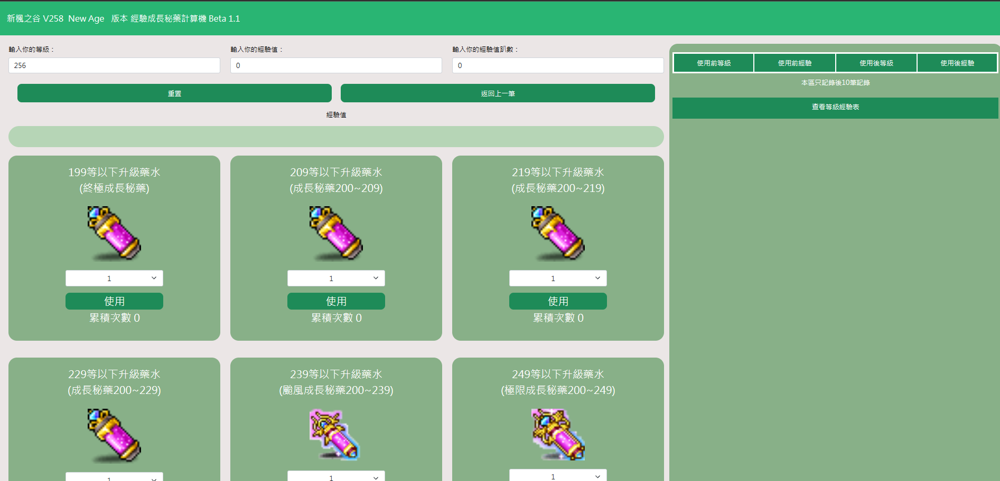

# 新楓之谷經驗秘藥V258計算機 測試中 版本Beta1.1
# 網站連結
<a href="https://maplestoryexpcount.github.io/">經驗秘藥V258計算機 測試中 版本Beta1.1</a>
## 前文

鑑於最近楓之谷活動給許多秘藥，和看到版上有部分人也製作其他功能計算機下，因此開發了可以方便使用秘藥來達成最大效益的計算機。

但由於是程式新手所以部分程式碼可能有略為雜亂><
若有Bug或有更佳的寫法也感謝提供

## BUG列表
<ul><li>暫無</li></ul>

## 版本更新紀錄
<ul>
  <li>Beta 1.0.0 最初版本 2021/04/16</li>
<li>Beta 1.0.1 修正了負值和可以直接按消除經驗消除紀錄 2021/04/17</li>
<li>Beta 1.0.2 按鈕設定1秒只能按一次</li>
<li>Beta 1.0.3 更新最新經驗需求 以及版面重新配置 2022/8/9</li>
<li>Beta 1.0.4 更新等級範圍內升級bug 新增重置以及上一布(僅限右邊顯示紀錄內) 2022/8/22</li>
<li>Beta 1.0.5 更新秘藥文字以及圖片 2023/4/5</li>
<li>Beta 1.0.6 更新Savior版本調降經驗 2023/6/20</li>
<li>Beta 1.0.7 更新可批次使用功能 修正bug 2023/6/22</li>
<li>Beta 1.1    更新New Age版本調降經驗 2024/1/16</li>
</ul>

## 畫面預覽

## 畫面介紹

等級欄位：輸入自身等級 (1~300)　使用後會依據是否提高等級來自動更新數據 

經驗值欄位(值)：輸入自身經驗值(值)(0+) 此欄位需輸入準確數值 使用後會依據是否提高等級來自動更新數據

經驗值欄位(趴數)：輸入自身等級(0+)　此欄位輸入大約趴數 使用後會依據是否提高等級來自動更新數據

經驗值條：使用後會顯示你使用後經驗值趴數為多少

結果欄位： 
<ol>
  <li>會依據你使用秘藥順序列出 </li>
  <li>會顯示你從幾等吃到幾等</li>
</ol>

秘藥：選擇需要使用秘藥 對應使用該名稱的秘藥

### 秘藥介紹
<ol>
  <li>199等以下升級藥水(終極成長秘藥)：200等以下根據公式隨機提高等級，200等以上使用給予199等升級所需經驗量</li>
  <li>209等以下升級藥水(成長秘藥200~209)：210等以下提高一等，200等以上使用給予209等升級所需經驗量</li>
  <li>219等以下升級藥水(成長秘藥210~219)：220等以下提高一等，210等以上使用給予219等升級所需經驗量</li>
  <li>229等以下升級藥水(成長秘藥220~229)：230等以下提高一等，220等以上使用給予229等升級所需經驗量</li>
  <li>239等以下升級藥水(成長秘藥230~239)：240等以下提高一等，230等以上使用給予239等升級所需經驗量</li>
  <li>249等以下升級藥水(成長秘藥240~249)：250等以下提高一等，240等以上使用給予249等升級所需經驗量</li>

</ol>

## 使用教學
<ol>
  <li>
  輸入您的等級
  </li>
  <li>
    輸入您的經驗值，若輸入完整值，數據會較準確，若在趴數欄位輸入會因小數點而有誤差
  </li>
  <li>
     在您想要使用的藥水選單中選擇使用數量後，按下使用
  </li>
  <li>
     在右側會顯示使用後10筆的結果
  </li>
</ol>

## 注意事項：
<ul> 
  <li>不可輸入負值(目前有設定輸入會有提示)</li>
  <li>本網頁僅提供實際效果依使用為準，此網頁僅提供模擬</li>

  <li>且感謝巴哈姆特網友g555555g（玥御夜）提供經驗表  來源：<a href="https://forum.gamer.com.tw/C.php?bsn=7650&snA=1006510">TMSv236 NEO 成長秘藥 等級經驗量表（適用TMSv235～v243）</a></li>
  <li> <a href="https://strategywiki.org/wiki/MapleStory/EXP_and_Pet_Closeness">v253 版本後經驗數據</a></li>
</ul>

## 問題回報：
<a href="https://forum.gamer.com.tw/C.php?bsn=7650&snA=1014201">巴哈姆特 新楓之谷專版 文章</a>

### 本文同步發布於 巴哈姆特 新楓之谷專版 文章

